# Predicting NVDA Stock Prices: A Comparison of Baseline, Time-Series, and Machine Learning Models 
## Overview and Analysis Objective

The objective of this project is to forecast the short-term closing price of NVIDIA (NVDA) stock and evaluate the predictive performance of multiple modeling approaches across different forecast horizons. The study compares baseline models, classical time-series methods, and machine learning models to assess how forecast accuracy changes from short horizons (1–5 days) to longer horizons (up to 30 days). 

Model performance is evaluated using Root Mean Squared Error (RMSE) to provide a consistent comparison across forecasting methods.
        
## Table of Contents 
- [Data Description](#data-description)
- [Exploratory Data Analysis (EDA)](#exploratory-data-analysis-eda)
- [Forecasting Models](#forecasting-models)
- [Baseline Forecast Models](#baseline-Forecast-Models)
  - [Baseline Forecast Models](#baseline-forecast-models)
  - [ARIMA Model](#arima-model)
  - [Prophet Model](#prophet-model)
  - [Price-Based Models](#price-based-models)
  - [Return-Based Models](#return-based-models)
- [Model Comparison](#model-comparison)

## Data Description
This project uses historical market data for NVIDIA (NVDA) along with selected market indicators to construct forecasting models. The dataset compares NVIDIA (NVDA) with other semiconductor companies (AMD, TSM) and the broader technology index (QQQ) and includes daily stock prices and trading volumes covering the period from January 01, 2021, through February 05, 2026. The historical market data is obtained from Yahoo Finance / yfinance and is recorded at a business-day frequency, resulting in approximately five years of observations used for model training, testing, and forecasting.

## Exploratory Data Analysis (EDA) 

### Price and Volumne Charts

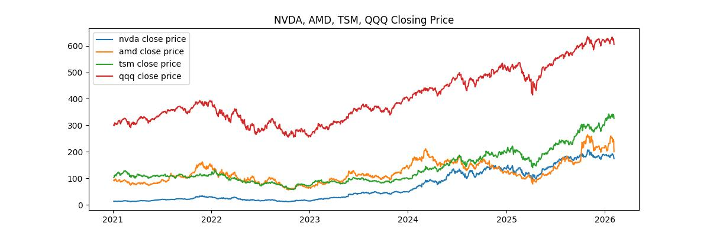

All stocks show an upward trend over the sample period, reflecting growth in the semiconductor and technology sectors. 

NVDA exhibits the strongest growth trajectory in the later years of the dataset, coinciding with increased demand for AI-related computing hardware. While AMD and TSM also demonstrate significant growth, NVDA’s acceleration highlights its dominant role within the sector.

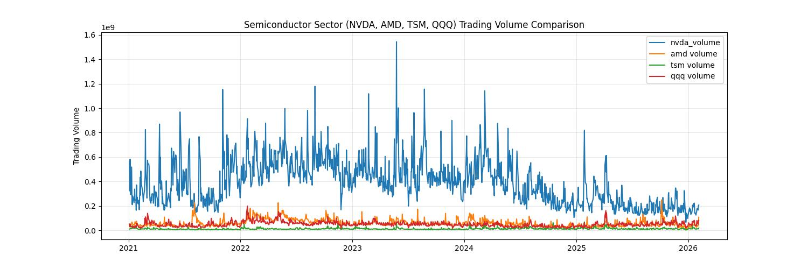

The volume chart shows NVDA consistently displays higher trading volume and more frequent spikes than its peers, indicating strong investor interest and active market participation. 

Periods of increased trading activity often coincide with major price movements, suggesting that changes in trading volume reflect shifts in market sentiment and information flow.

### NDVA Price Return Patterns

To investigate potential calendar effects, average daily returns are aggregated across the sample period.

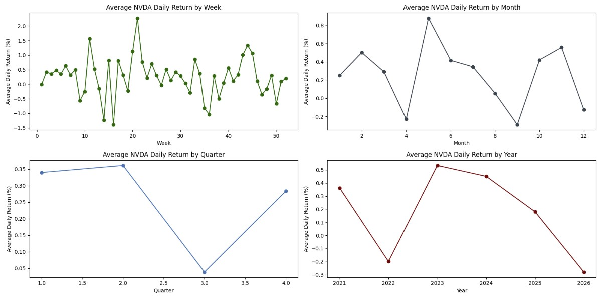

The results show limited consistent seasonal structure, suggesting that NVDA price movements are dominated by trend and volatility rather than deterministic seasonal cycles.

## Forecasting Models

### Baseline Forecast Models

To establish a benchmark for model performance, two simple baseline forecasting approaches were implemented. These models serve as a reference point for evaluating whether forecasting methods improve predictive accuracy.

Naive Baseline: assumes the future price equals the most recent observed price.

#### Baseline Models Performance

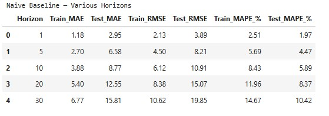

Naive Drift: extends the naive model by incorporating the average daily price change observed in the training data.

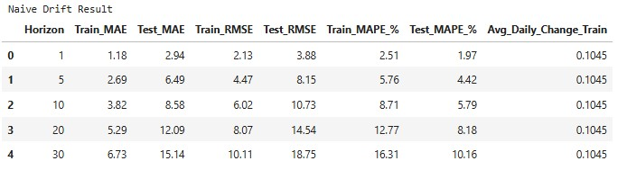

#### Baseline Models Summary

Comparing the two baseline approaches shows that the drift model leads to modest improvements, especially at longer forecast horizons. However, the gains remain relatively small, highlighting the inherent difficulty of predicting short-term stock price movements.

➡️ Full analysis: [`01_eda_and_naive_baseline.ipynb`](01_eda_and_naive_baseline.ipynb)

### ARIMA Model

The ARIMA (AutoRegressive Integrated Moving Average) model is implemented as a classical time-series forecasting approach for predicting the short-term closing price of NVIDIA (NVDA). Model parameters are evaluated using information criteria and forecast accuracy metrics to determine an appropriate ARIMA specification.

Stock prices are typically non-stationary, meaning their mean and variance change over time. To satisfy the stationarity requirement for the ARIMA models, the NVDA price series is transformed using first differencing. First differencing removes the long-term trend by modeling day-to-day price changes rather than price levels. The transformed series fluctuates around zero, indicating that the underlying trend has been removed, and that the series is suitable for ARIMA modeling.

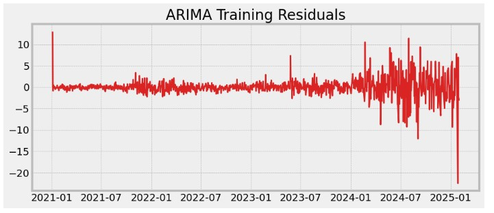

#### ARIMA Time-Series Forecasting Model Performance

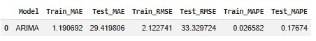

The ARIMA model captures the general trend of the series but produces larger forecast errors compared to simpler baseline models.

#### 30-Day Forecast Charts

NVDA Price History + Forecast Window

The fitted ARIMA model was used to generate a 30-day forecast of NVDA closing prices. NVDA Price History + Forecast Window. The forecast window is highlighted in red in the final portion of the series.

The forecast includes a 95% confidence interval that widens over time, reflecting increasing uncertainty as the forecast horizon grows.

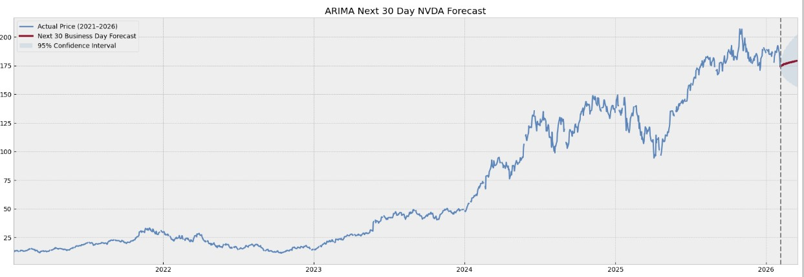

Zoom on Last Months + Forecast

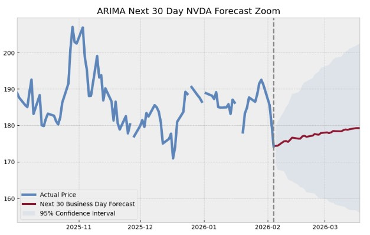

#### ARIMA Model Summary

The ARIMA model captures the overall direction of the time series but struggles to represent short-term variability and volatility. While the model follows the long-term trend, forecast accuracy deteriorates as the prediction horizon increases. These results suggest that linear autoregressive structures alone may not fully capture the dynamics of NVDA price movements, motivating the exploration of machine learning models in the next section.

➡️ Full analysis: [`02_arima_price_model.ipynb`](02_arima_price_model.ipynb)

### Prophet Model

The Prophet forecasting model is also evaluated as an alternative time-series approach. Prophet is designed to capture trend, seasonality, and holiday effects in time-series data using an additive model framework. Unlike ARIMA, Prophet does not require explicit stationarity transformations and is designed to handle irregular patterns in the data.

* Training window: Jan 01, 2021 – Feb 3, 2025
* Test window: Feb 3, 2025 – Feb 3, 2026
* Forecast horizon: 30 business days
* Frequency: business days (freq='B')
* Seasonality: yearly enabled, weekly and daily disabled
The model is trained only on the training window and evaluated on the test window to ensure realistic forecasting performance.

#### Prophet Time-Series Forecasting Model Performance

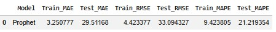

The Prophet model captures the general trend of the series but produces larger forecast errors compared to simpler baseline models.

#### Train, Test and Future 30 Days Forecast Charts

The below charts show Prophet trains on historical NVDA prices, evaluates on a 90-day test window, and generates a 30-business-day forward forecast with 95% confidence intervals.

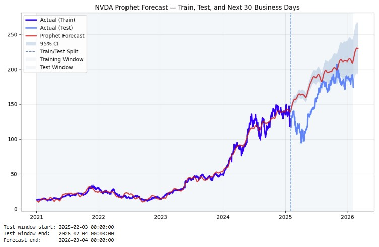
prophet_next30Day_nvda_forecast.jpg
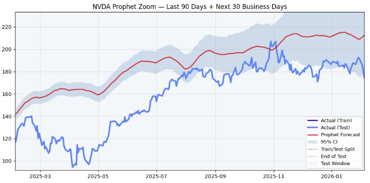

#### Prophet Model Summary

Prophet captures the long-term upward smooth trend in NVDA prices but struggles to fully capture short-term volatility during the test window. Forecast accuracy deteriorates during periods of rapid market movement, suggesting that additive seasonal models may have limited ability to model the complex dynamics of equity price movements.

➡️ Full analysis: [`03_prophet_price_model.ipynb`](03_prophet_price_model.ipynb)

### Price-Based Models

The objective of the price-based models is to evaluate whether machine learning methods using lagged price features and cross-asset signals can improve short-term forecasts of NVDA stock prices compared to traditional time-series models.

##### Pearson Correlation Chart

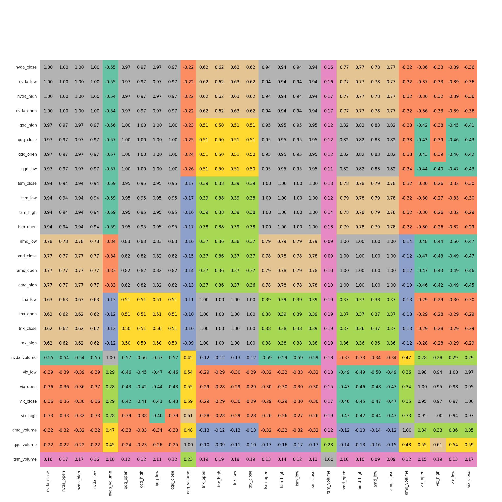

The correlation matrix shows strong positive relationships between NVDA and other semiconductor-sector assets. NVDA prices are highly correlated with QQQ and TSM (0.94–0.97) and moderately correlated with AMD (0.77), reflecting shared market technology sector. Volatility indicators such as VIX exhibit a weak negative relationship with NVDA, consistent with the typical inverse relationship between market volatility and equity prices.

These relationships motivate the inclusion of cross-asset features (AMD, TSM, and QQQ) in the machine learning models.

### Models Evaluated
Three price-based models are evaluated with increasing feature complexity.

### NVDA-Only Linear Regression
This model uses only lagged NVDA price features to forecast future prices in order to test whether a simple autoregressive ML model can outperform classical time-series models.

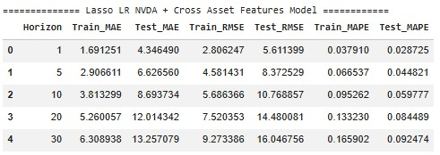

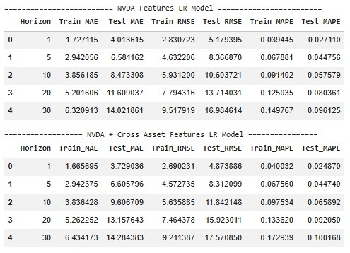

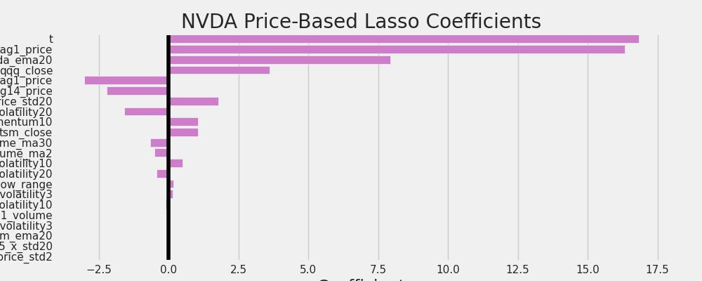

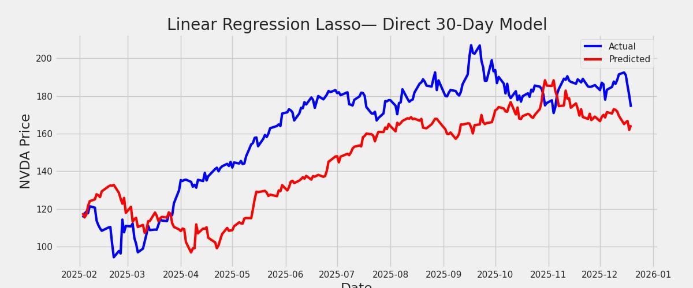

### Return-Based Models

## Model Comparison

